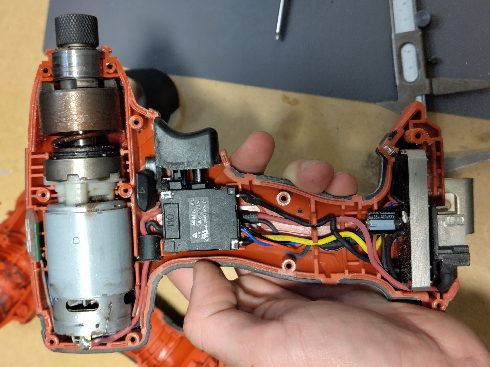
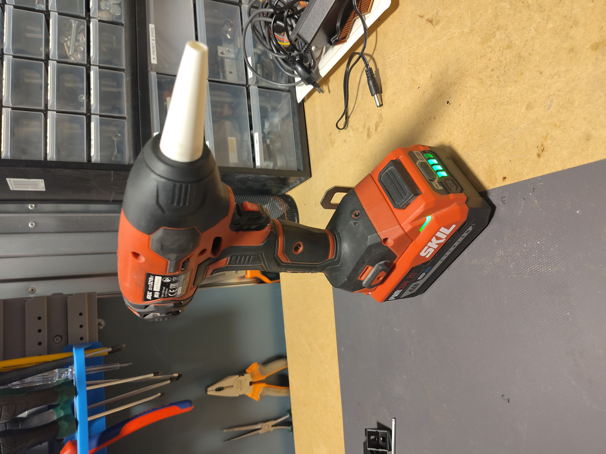

# What to do without compressor

Life with a good compressor is nice, not only for airing up tires or inflating beach balls but in a workshop it probably gets used the most to 'clean'. In reality you just blow the dust and junk into other places and on the floor but thats okay.

I find myself in a small workspace without one and thus I need another solution.

Over the last years many  '100 000 rpm' handheld blowers have flooded the market, even my barber uses them. They have battery packs in the handle and a little metal ducted fan to do the work.

These appeared because of an innovation in the balancing of the turbine blades, which was the limiting factor in producing these small turbines which were greatly used by Dyson for their products.

Anyways, they are now €20 on Aliexpress, with the control circuity included. Happy times.

I had an old Skil impact drill that I had replaced with a better brushless version... and it so happens that it has a similar shape to the aforementioned commercial blowers. Furthermore I could use the batteries I already have.

Therefore I gutted the brushed motor with its planetary gearbox and its speedcontroller for [the set](https://www.aliexpress.com/item/1005007723193238.html) I got from our Chinese friends. I made sure to get one with intergrated speed controller and compatible with my ~20V batteries.

And so it came to be. A small toggle switch fit inside the original trigger, the potentiometer controlling the ESC (Electronic Speed Control) fit where the direction switch used to go and with a custom printed 'sock' the blower was happy too.

To make it work more like a compressor I printed a TPU (Thermoplastic Poly Urethane, flexible/soft but tough) nozzle which was retained by the same lip that once held a rubber seal.

All in all an usefull tool for the smaller workshop.

| Before                    | During               | After              |
| --------------------------- | ---------------------- | -------------------- |
|  |  |  |
